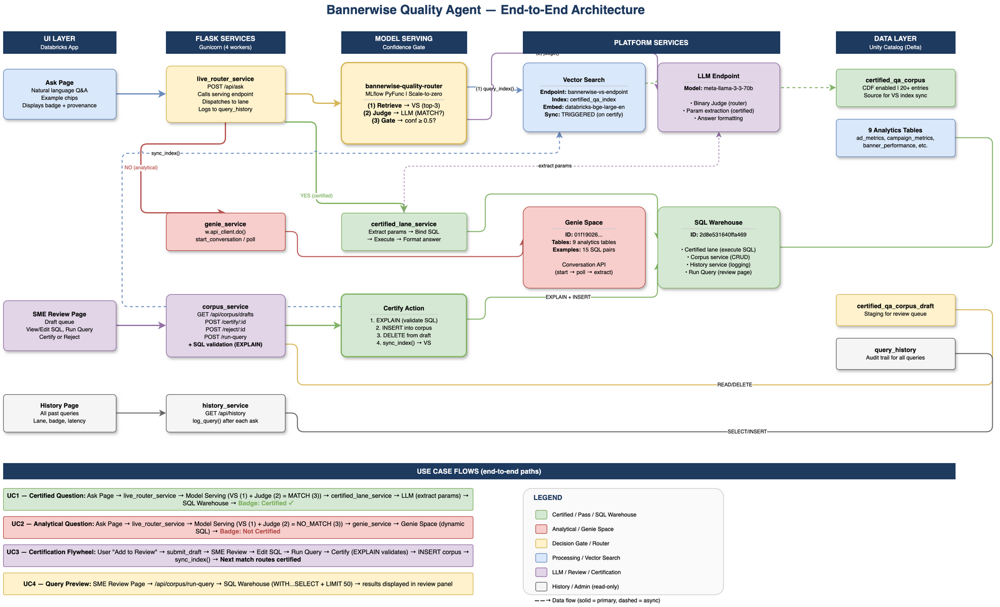
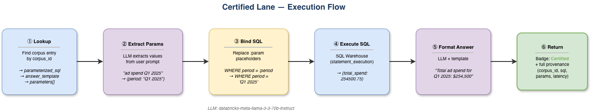
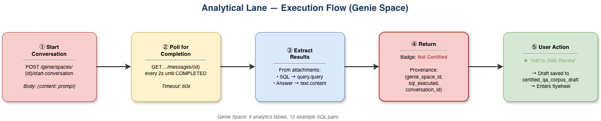
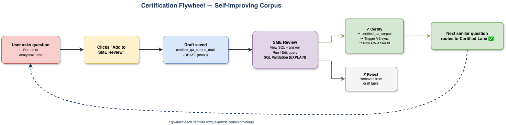
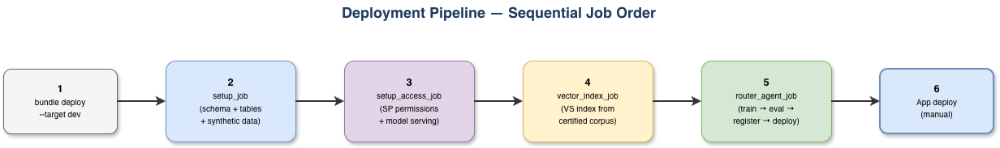
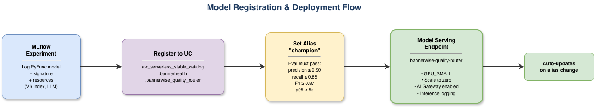

# Bannerwise Quality Agent — Technical Solution Design

## 1. Architecture Overview

<!-- Diagram: docs/diagrams/01_architecture_overview.drawio -->


---

## 2. Router Agent — Detailed Design

The Router Agent is an MLflow PyFunc model served via Databricks Model Serving. It implements a 3-step pipeline: **Retrieve → Judge → Gate**.

> **Design Philosophy**: The router uses a deterministic pipeline (not agentic tool selection) to ensure predictable, auditable routing decisions. Every question always goes through the same 3 steps in the same order.

---

### Step 1 — Vector Search Retrieval

**Current Behavior:**

The user's prompt is embedded using `databricks-bge-large-en` and compared against the `certified_qa_index` (cosine similarity). The top `k=3` candidates are returned with their similarity scores.

| Aspect | Detail |
| --- | --- |
| Embedding Model | `databricks-bge-large-en` |
| Index | `aw_serverless_stable_catalog.bannerhealth.certified_qa_index` |
| Embedding Source Column | `embedding_text` (NOT `question`) |
| Sync Mode | Delta Sync (TRIGGERED — manually synced on certify action) |
| Top-K | 3 candidates |
| Similarity | Cosine |
| Fields Returned | `corpus_id`, `question`, `embedding_text`, `score`, `status`, `parameterized_sql`, `answer_template`, `parameters` |
| CDF Requirement | Source table must have Change Data Feed enabled for Delta Sync |

**Dual-Column Embedding Strategy:**

The corpus table has two text columns for different purposes:

| Column | Purpose | Example |
| --- | --- | --- |
| `question` | Display + LLM Judge (keeps `{param}` placeholders) | "What is the total ad spend for {period}?" |
| `embedding_text` | VS embedding + retrieval (params stripped for intent matching) | "What is the total ad spend?" |

**Why?** The embedding model (`bge-large-en`) treats `{period}` as a literal token, not a variable. When a user asks "What is the total ad spend for Q1 2025?", the cosine similarity against "...for {period}?" is only ~0.68. Against the stripped version "...total ad spend?" it's ~0.82+. This is because stripping parameters forces the embedding to focus on **analytical intent** rather than matching parameter tokens.

The `generate_embedding_text()` function strips `{param}` placeholders and removes trailing dangling prepositions:
- "What is the total ad spend for {period}?" → "What is the total ad spend?"
- "How many impressions did the {campaign} campaign generate?" → "How many impressions did the campaign generate?"
- "What is the click-through rate by banner size?" → unchanged (no params)

**How it works:**
- Vector Search returns candidates ranked by cosine similarity (0.0–1.0)
- Embedding is computed on `embedding_text` (stripped of parameters) for better intent matching
- A score of 0.80+ typically indicates a strong semantic match (improved from 0.68 with old approach)
- However, **VS score alone is insufficient** for routing — two questions can have high similarity but different intent (e.g., "ROI for summer campaign" vs. "highest ROI campaign")
- That's why Step 2 (LLM Judge) uses the original `question` (with `{param}` placeholders) — the LLM understands parameterization

**Possible Enhancements:**
- **Hybrid search**: Combine vector similarity with keyword/BM25 matching for better recall on short queries
- **Pre-filtering by status**: Only retrieve `status='certified'` entries (skip expired/draft)
- **Dynamic top-k**: Increase k for ambiguous queries, decrease for high-confidence single matches
- **Embedding fine-tuning**: Train a domain-specific embedding model on Banner Health's Q&A pairs
- **Multi-index retrieval**: Separate indexes for different question categories (spend, performance, attribution)
- **Multiple example phrasings**: Store 3-5 representative queries per corpus entry for embedding

---

### Step 2 — LLM Judge

**Current Behavior:**

The LLM Judge receives the user's question and the top corpus candidate, then evaluates whether they have the **same semantic intent**. It outputs a binary **YES/NO** verdict.

| Aspect | Detail |
| --- | --- |
| Model | `databricks-meta-llama-3-3-70b-instruct` |
| Input | User prompt + best corpus candidate question |
| Output | Binary: `YES` (same intent) or `NO` (different intent) |
| Prompt Design | "Does the user's question have the same intent as this certified question? Consider that parameters (dates, campaign names) may differ but the underlying analytical question is the same." |

**How it works:**
- The judge is asked a simple equivalence question
- `YES` means: the user is asking the same thing as the certified question, possibly with different parameters
- `NO` means: the user is asking something fundamentally different
- This maps to confidence: YES → 1.0, NO → 0.0

**Examples:**

| User Question | Corpus Match | Judge | Why |
| --- | --- | --- | --- |
| "What is the total ad spend for Q1 2025?" | "What is the total ad spend for {period}?" | YES | Same intent, different parameter |
| "Which campaign had the highest ROI?" | "What was the ROI for the {campaign} campaign?" | NO | User wants ranking across ALL campaigns; corpus asks about ONE specific campaign |
| "Compare CPM across all regions" | "Which regions have the highest CPM?" | YES | Same analytical intent, different phrasing |

**Possible Enhancements:**
- **Graduated confidence scoring**: Instead of binary YES/NO, have the judge output a confidence score (0–100). This creates a meaningful range:
  - 85–100: High confidence → Certified Lane
  - 50–84: Medium confidence → Certified Lane with "verify" flag
  - 25–49: Low confidence → Analytical Lane with "similar certified answer available" note
  - 0–24: No match → Analytical Lane
- **Multi-candidate evaluation**: Judge all top-k candidates (not just the best) and pick the highest-scoring one
- **Chain-of-thought reasoning**: Ask the judge to explain reasoning before concluding
- **Few-shot examples**: Include labeled examples in the judge prompt for better calibration
- **Judge ensemble**: Use 2 different LLMs as judges and require agreement
- **Parameter-aware judging**: Explicitly tell the judge which parameters are expected

---

### Step 3 — Confidence Gate

**Current Behavior:**

The gate is a simple threshold check. Since the judge outputs binary (0.0 or 1.0), the threshold of 0.5 is merely a separator — any value between 0.01 and 0.99 would produce identical behavior.

| Aspect | Detail |
| --- | --- |
| Threshold | `0.5` (configurable via `CONFIDENCE_THRESHOLD`) |
| Judge YES → confidence 1.0 | Passes gate → **Certified Lane** |
| Judge NO → confidence 0.0 | Fails gate → **Analytical Lane** |
| Effect of threshold | With binary judge, threshold is just a separator. No query ever scores between 0 and 1. |

**Why this works for a demo:**
The binary approach is simple, predictable, and easy to explain. The quality control lives entirely in the judge prompt quality, not in threshold tuning.

**Possible Enhancements:**
- **Graduated thresholds** (requires graduated judge above):
  - `threshold_certified = 0.85` — high bar for certified answers
  - `threshold_suggest = 0.50` — medium bar for "similar certified answer available"
  - Below 0.50 — pure analytical lane
- **Dynamic thresholds**: Adjust based on corpus coverage per domain
- **Shrink factor**: A multiplier on the judge score to account for over-confidence (`final_score = raw_score * shrink_factor`). Currently 1.0 (no shrink).
- **Multi-gate routing**: Add a third "human-in-the-loop" lane for borderline cases (50–85%)

---

## 3. Certified Lane — Execution Flow

When the gate says YES, the certified lane executes the pre-approved SQL with extracted parameters.

<!-- Diagram: docs/diagrams/02_certified_lane_flow.drawio -->


**LLM Endpoint**: `databricks-meta-llama-3-3-70b-instruct` (for parameter extraction and answer formatting)

---

## 4. Analytical Lane — Execution Flow

When the gate says NO, the analytical lane forwards to the Genie Space for dynamic SQL generation.

<!-- Diagram: docs/diagrams/03_analytical_lane_flow.drawio -->


**Genie Space Configuration:**
- 9 analytics tables registered
- 15 sample questions + 15 example SQL pairs
- Instructions: "Always answer directly, never ask clarifying questions"
- Deployed as a DABs resource (`engine: direct` required for Genie resources)

### SQL Auto-Correction (Post-Genie)

Genie occasionally generates SQL with syntax errors — most commonly **unquoted string literals** (e.g., `WHERE period = Q2 2025` instead of `WHERE period = 'Q2 2025'`). These would fail if executed or if saved to the draft table for certification.

The system applies a **two-tier correction** after every Genie response and when loading draft entries for SME review:

| Tier | Method | Latency | Coverage |
| --- | --- | --- | --- |
| 1 (fast path) | Regex pattern matching | <1ms | Multi-word unquoted strings after `=`, `!=`, `<>` |
| 2 (fallback) | LLM (`databricks-meta-llama-3-3-70b-instruct`) | ~1-2s | All other syntax issues |

**Regex fast path** — detects unquoted multi-word values by identifying tokens after comparison operators that contain spaces but are not SQL keywords. Examples:
- `WHERE period = Q2 2025 AND ...` → `WHERE period = 'Q2 2025' AND ...`
- `WHERE region = North America GROUP BY` → `WHERE region = 'North America' GROUP BY`

**LLM fallback** — if regex finds no issues, the SQL is sent to the LLM with a strict prompt:
- Fix ONLY syntax errors (unquoted strings, missing quotes)
- Do NOT change table names, column names, aliases, or query structure
- Do NOT add LIMIT, ORDER BY, or any new clauses
- Return corrected SQL only (no markdown, no explanation)

**Safety guardrails:**
- Sanity check: LLM output must start with `SELECT` or `WITH` to be accepted
- Non-blocking: if LLM call fails (auth, timeout), original SQL is returned unchanged
- Single-word values are never auto-quoted (could be column references)

**Where it runs:**
1. `genie_service.py` → `_extract_result()` — corrects SQL immediately after Genie returns
2. `corpus_routes.py` → `api_corpus_draft_detail()` — corrects SQL when SME opens a draft for review

This ensures the SME Review page always shows syntactically valid SQL, and "Run Modified Query" works without manual fixing.

---

## 5. Certification Flywheel

The certification flywheel is the mechanism by which the system self-improves over time. Each uncertified answer is an opportunity to expand the certified corpus.

<!-- Diagram: docs/diagrams/04_certification_flywheel.drawio -->


**Key design decisions:**
- CDF must remain enabled on `certified_qa_corpus` for Delta Sync to work
- Test data uses TRUNCATE + append (not `mode("overwrite")`) to preserve CDF
- Certified entries get a 180-day `next_review_date` (staleness gate)
- The Review page allows SQL modification before certification (SME can fix the query)
- **SQL auto-correction on view**: When an SME opens a draft, the SQL is automatically corrected (regex + LLM) before display — the SME sees valid SQL in the editor without manual fixing
- **SQL validation gate**: Before certification, `EXPLAIN` is run against the SQL to catch syntax errors (e.g., malformed regex, unquoted literals). Parameter placeholders (`:param`) are substituted with dummy values for validation. If validation fails, certify returns HTTP 422 with the error — the entry remains in draft.
- **Run Query endpoint**: Strips trailing semicolons and only appends `LIMIT 50` if no LIMIT is already present

---

## 6. Jobs Design — Initial Setup & Deployment Pipeline

### Deployment Order

The jobs must be run in this order for a fresh deployment (access job runs last because it grants permissions on resources created by earlier jobs):

<!-- Diagram: docs/diagrams/05_deployment_order.drawio -->


---

### Job 1: `bannerwise-quality-agent-setup`

**Purpose:** Full clean-slate initialization — resets the VS index, creates all tables, and populates with data. Run this once for a fresh deployment or whenever a complete reset is needed.

| Task | Notebook | Depends On | Actions |
| --- | --- | --- | --- |
| `reset_vector_index` | `notebooks/vs/cleanup_vector_index` | — | Removes stale VS index (may be bound to a destroyed endpoint after bundle destroy/redeploy). Handles "not found" gracefully. |
| `create_system_tables` | `notebooks/data/create_tables` | — | Creates system tables (corpus w/ CDF, draft, history, review queue) using `CREATE OR REPLACE TABLE` |
| `seed_corpus` | `tests/notebooks/setup_test_data` | `create_system_tables` | Seeds 20 certified QA entries with auto-generated `embedding_text` |
| `create_app_tables` | `notebooks/data/create_synthetic_data` | `create_system_tables` | Creates and populates 9 analytics tables used by certified SQL templates and Genie Space |

**Task parallelism:** `reset_vector_index` and `create_system_tables` run in parallel (no dependency). `seed_corpus` and `create_app_tables` run in parallel after `create_system_tables` completes.

**Parameters passed:** `catalog_name`, `schema_name`

**DDL Strategy:** System tables use `CREATE OR REPLACE TABLE` (always applies latest schema, idempotent on re-run). CDF is enabled on `certified_qa_corpus` for VS Delta Sync. Analytics tables also use `CREATE OR REPLACE` with inline INSERT.

**Why reset VS index here?** After `bundle destroy` + redeploy, the VS endpoint gets a new internal ID but a stale index may still reference the old endpoint. The `vector_index_job` (Job 3) would fail with "endpoint not found" unless the stale index is removed first.

**Staleness invariant:** Stale entries (past `next_review_date`) must not exceed **10%** of the corpus. The seed data includes 2 stale entries (10%) for testing the staleness check. The eval pipeline tolerates staleness-caused false negatives proportionally — recall targets account for up to 10% of certified entries being correctly rejected by the staleness gate.

**Tables created:**
- System: `certified_qa_corpus` (CDF enabled + 20 seeded entries), `certified_qa_corpus_draft`, `query_history`, `sme_review_queue`
- Analytics: `ad_metrics`, `campaign_metrics`, `banner_performance`, `regional_metrics`, `network_metrics`, `channel_metrics`, `session_metrics`, `creative_performance`, `attribution_metrics`

---

### Job 2: `bannerwise-quality-agent-vector-index`

**Purpose:** Create the Vector Search Delta Sync index on the certified QA corpus.

| Task | Notebook | Actions |
| --- | --- | --- |
| `create_vector_search_index` | `notebooks/vs/create_vector_search_index` | 1. Verify VS endpoint exists  2. Create Delta Sync index (or sync if exists)  3. Wait for ONLINE status  4. Verify with test query |

**Index configuration:**
- Source: `certified_qa_corpus` (requires CDF enabled)
- Embedding column: `embedding_text` → embedded via `databricks-bge-large-en`
- Sync mode: TRIGGERED (manually triggered on each certify action via `sync_index` API)
- Columns synced: `id`, `question`, `embedding_text`, `parameterized_sql`, `answer_template`, `parameters`, `status`, `certified_by`, `certified_date`, `next_review_date`

**Prerequisites:**
- `certified_qa_corpus` must exist and have data (populated by `setup_job` → `seed_corpus`)
- CDF must be enabled on the table
- VS endpoint `bannerwise-vs-endpoint` must be provisioned (by DABs deploy)
- Stale index must be removed first (handled by `setup_job` → `reset_vector_index`)

---

### Job 3: `bannerwise-quality-agent-router`

**Purpose:** Train the router agent, evaluate it, register as MLflow model, deploy to Model Serving, and configure AI Gateway.

| Task | Notebook | Depends On | Actions |
| --- | --- | --- | --- |
| `run_router_agent` | `notebooks/agent/router_agent` | — | Define PyFunc model, log to MLflow, test locally |
| `run_eval` | `notebooks/eval/run_router_eval_v2` | `run_router_agent` | Run eval dataset against model, compute metrics |
| `register_model` | `notebooks/agent/register_router_model` | `run_eval` | Register to UC, set alias "champion" |
| `deploy_serving_endpoint` | `notebooks/agent/deploy_serving_endpoint` | `register_model` | Create/update endpoint, wait for READY |
| `configure_ai_gateway` | `notebooks/agent/configure_ai_gateway` | `deploy_serving_endpoint` | Enable gateway, rate limits, inference logging |

**Parameters:** `catalog_name`, `schema_name`, `model_name`, `serving_endpoint_name`, `judge_model`, `confidence_threshold`, `shrink_factor`, VS params, Genie params

---

### Job 4: `bannerwise-quality-agent-access`

**Purpose:** Grant the application service principal all required permissions. All 4 tasks run in **parallel** (no dependencies between them).

> **Why last (before eval)?** This job grants permissions on the VS index and serving endpoint — both must exist first (created by Jobs 2 and 3).

| Task | Notebook | Permissions Granted |
| --- | --- | --- |
| `configure_uc_access` | `notebooks/access/setup_uc_access` | USE CATALOG, USE SCHEMA, SELECT, MODIFY + CAN_USE on SQL Warehouse |
| `configure_vs_access` | `notebooks/access/setup_vs_access` | CAN_USE on VS endpoint `bannerwise-vs-endpoint` |
| `configure_endpoint_access` | `notebooks/access/setup_endpoint_access` | CAN_QUERY on serving endpoint + LLM endpoint |
| `configure_genie_access` | `notebooks/access/setup_genie_access` | CAN_RUN on Genie Space (via `/api/2.0/permissions/genie/{id}`) |

**Parameters passed:** `app_sp_id` (from `${resources.apps.bannerwise_quality_agent.service_principal_id}`), resource IDs

**Important note on Genie permissions:** The correct API path is `/api/2.0/permissions/genie/{space_id}` — NOT `/permissions/dashboards/` or `/permissions/genie-spaces/`. This was discovered through trial and error.

---

### Job 5: `bannerwise-quality-agent-eval`

**Purpose:** Standalone evaluation pipeline (can be run independently to re-evaluate after corpus changes).

#### Layered Evaluation Design

The eval separates three independent accuracy layers so we can pinpoint where failures occur:

```
┌─────────────────────────────────────────────────────────────────┐
│  Layer 1: VS RETRIEVAL ACCURACY (embedding_text target)         │
│  ─────────────────────────────────────────────────────────      │
│  Question: Does VS return the correct corpus entry in top-k?    │
│  Input: User prompt → VS query on embedding_text column         │
│  Metric: retrieval_hit_rate (correct entry in top-3)            │
│  Target: >= 0.80 (up from ~0.60 before embedding_text fix)      │
│  Scope: All rows with expected_corpus_id (positives only)       │
│                                                                 │
│  WHY THIS IS THE KEY METRIC:                                    │
│  The embedding_text column strips {param} placeholders so       │
│  "What is the total ad spend?" embeds against intent, not       │
│  literal "{period}" tokens. This is what moves us from 60→80+.  │
├─────────────────────────────────────────────────────────────────┤
│  Layer 2: JUDGE ACCURACY (given correct VS retrieval)           │
│  ─────────────────────────────────────────────────────────      │
│  Question: When VS finds the right entry, does LLM correctly    │
│            say MATCH or NO_MATCH?                               │
│  Metrics:                                                       │
│    judge_precision: MATCH decisions that were correct            │
│    judge_recall: true matches the judge correctly accepted       │
│  Target: judge_precision >= 0.90, judge_recall >= 0.85          │
│  Scope: Only rows where VS retrieved the expected entry         │
├─────────────────────────────────────────────────────────────────┤
│  Layer 3: END-TO-END ROUTING                                    │
│  ─────────────────────────────────────────────────────────      │
│  Question: Does the full pipeline (VS + Judge + Staleness +     │
│            Gate) correctly route to certified vs analytical?     │
│  Metrics:                                                       │
│    gate_precision: certified predictions that are correct        │
│    gate_recall: certified questions correctly found              │
│    staleness_adjusted_recall: recall excluding stale entries     │
│  Targets:                                                       │
│    gate_precision >= 0.85                                        │
│    staleness_adjusted_recall >= 0.80                            │
│  Note: staleness_adjusted_recall excludes entries with past      │
│  next_review_date from FN count (they are EXPECTED to fail)     │
└─────────────────────────────────────────────────────────────────┘
```

#### Deployment Gate Summary

| Gate | Metric | Target | Blocks Deploy? |
| --- | --- | --- | --- |
| **Layer 1** | `vs_retrieval_hit_rate` | >= 0.80 | YES |
| **Layer 2** | `judge_precision` | >= 0.90 | YES |
| **Layer 2** | `judge_recall` | >= 0.85 | YES |
| **Layer 3** | `gate_precision` | >= 0.85 | YES |
| **Layer 3** | `staleness_adjusted_recall` | >= 0.80 | YES |
| Advisory | `adversarial_rejection_rate` | >= 0.90 | NO |
| Advisory | `near_miss_rejection_rate` | >= 0.85 | NO |
| Advisory | `staleness_enforcement` | = 1.00 | NO |
| Advisory | `latency_p95` | < 5000ms | NO |

#### Staleness Tolerance

Stale entries (past `next_review_date`) account for <= 10% of corpus. These are CORRECTLY rejected by the staleness gate. The eval handles this by:
1. `stale_entry_test` category expects `analytical` lane (staleness gate fires)
2. `staleness_adjusted_recall` excludes stale-corpus FNs from the recall denominator
3. `staleness_enforcement` metric (advisory) verifies 100% of stale entries are rejected

#### Stale Entry Detection

Stale entries are detected by `next_review_date < today()` (NOT by `status == 'expired'` — all entries have status='certified').

| Task | Notebook | Depends On | Actions |
| --- | --- | --- | --- |
| `generate_eval_dataset` | `notebooks/eval/generate_eval_dataset` | — | Generate positive + negative + edge case pairs |
| `run_router_eval` | `notebooks/eval/run_router_eval_v2` | `generate_eval_dataset` | Call serving endpoint for each pair, record results |
| `check_eval_thresholds` | `notebooks/eval/check_eval_thresholds` | `run_router_eval` | Quality gates: precision≥0.90, recall≥0.85, F1≥0.87, p95 latency<5s |

**Quality gates (if thresholds fail → job fails → no promotion):**
- Precision ≥ 0.90 (certified predictions are correct)
- Recall ≥ 0.85 (certified questions are found)
- F1 ≥ 0.87
- p95 latency < 5000ms

---

## 7. Permissions Management

### Service Principal Model

The app runs as a Databricks App with an automatically provisioned service principal. All access is granted to this SP — no user credentials are used at runtime.

| Permission | Target | Principal | API / Method |
| --- | --- | --- | --- |
| USE CATALOG | `aw_serverless_stable_catalog` | App SP | SQL GRANT |
| USE SCHEMA | `bannerhealth` | App SP | SQL GRANT |
| SELECT | All tables in schema | App SP | SQL GRANT |
| MODIFY | Schema (for INSERT into history/draft) | App SP | SQL GRANT |
| CAN_USE | SQL Warehouse `2d8e531640ffa469` | App SP | PATCH `/permissions/warehouses/{id}` |
| CAN_USE | VS endpoint `bannerwise-vs-endpoint` | App SP | PATCH `/permissions/vector-search-endpoints/{id}` |
| CAN_QUERY | Serving endpoint `bannerwise-quality-router` | App SP | PATCH `/permissions/serving-endpoints/{id}` |
| CAN_QUERY | LLM endpoint `databricks-meta-llama-3-3-70b-instruct` | App SP | PATCH `/permissions/serving-endpoints/{id}` |
| CAN_RUN | Genie Space `01f19026d0e61c88b840ce168a9be672` | App SP | PATCH `/permissions/genie/{id}` |
| SELECT | VS Index `certified_qa_index` | Model Serving | SQL GRANT TO `system-model-serving` |
| CAN_USE | VS endpoint `bannerwise-vs-endpoint` | Model Serving | PATCH (via `users` group) |

> **Critical Note:** The Model Serving endpoint (`bannerwise-quality-router`) uses `auth_type=model-serving` — a system-managed identity **separate from the App SP**. It needs its own explicit grants on UC securables. These grants are **lost when the VS index is deleted and recreated** and must be re-applied via the `setup_access_job`.

### Permission Resolution

The `setup_access_job` resolves the app SP using:
```python
# The app's SP application_id (UUID) is passed as a job parameter
# from: ${resources.apps.bannerwise_quality_agent.service_principal_id}
sp = w.service_principals.get(app_sp_id)
# sp.application_id is the UUID used in permissions API
```

### Permission API Patterns

All permission grants follow the same pattern:
```python
w.api_client.do(
    "PATCH",
    f"/api/2.0/permissions/{resource_type}/{resource_id}",
    body={
        "access_control_list": [{
            "service_principal_name": sp_application_id,
            "permission_level": "CAN_USE"  # or CAN_QUERY, CAN_RUN
        }]
    }
)
```

---

## 8. Model Training & Deployment

### Router Agent — MLflow PyFunc

The router is a **custom MLflow PyFunc** model, not a fine-tuned LLM. It orchestrates multiple Databricks services within a single `predict()` call:

```python
class RouterAgent(mlflow.pyfunc.PythonModel):
    def load_context(self, context):
        # Initialize clients for VS, LLM, SQL warehouse
        self.vs_client = VectorSearchClient()
        self.index = self.vs_client.get_index(...)
        
    def predict(self, context, model_input):
        prompt = model_input["prompt"][0]
        
        # Step 1: Vector Search
        candidates = self.index.similarity_search(
            query_text=prompt, columns=[...], num_results=3
        )
        
        # Step 2: LLM Judge (for each candidate)
        for candidate in candidates:
            verdict = self._judge(prompt, candidate["question"])
            if verdict == "YES":
                return {
                    "lane": "certified",
                    "confidence": 1.0,
                    "corpus_id": candidate["id"],
                    "vs_score": candidate["score"],
                    ...
                }
        
        # Step 3: No match → analytical
        return {"lane": "analytical", "confidence": 0.0, ...}
```

### Model Registration Flow

<!-- Diagram: docs/diagrams/06_model_registration_flow.drawio -->


### Model Versioning Strategy

| Alias | Purpose |
| --- | --- |
| `champion` | Currently deployed version serving production traffic |
| `challenger` | New version under evaluation (A/B testing) |

Promotion flow: train → eval passes thresholds → register → set alias `champion` → endpoint auto-updates.

### Serving Endpoint Configuration

| Setting | Value |
| --- | --- |
| Endpoint Name | `bannerwise-quality-router` |
| Workload Size | `GPU_SMALL` |
| Scale to Zero | `True` (cold start ~30s) |
| Model | UC registered model @ "champion" alias |
| AI Gateway | Enabled (rate limits + inference logging) |

---

## 9. Configuration Parameters

| Parameter | Default | Description |
| --- | --- | --- |
| `CONFIDENCE_THRESHOLD` | `0.5` | Gate threshold (binary judge: 1.0 passes, 0.0 fails) |
| `VS_TOP_K` | `3` | Number of candidates from Vector Search |
| `SHRINK_FACTOR` | `1.0` | Multiplier on judge score (1.0 = no adjustment) |
| `JUDGE_MODEL` | `databricks-meta-llama-3-3-70b-instruct` | LLM for semantic equivalence |
| `GENIE_SPACE_ID` | `01f19026d0e61c88b840ce168a9be672` | Genie Space for analytical lane |
| `GENIE_TIMEOUT_SEC` | `60` | Max wait for Genie response |
| `SQL_WAREHOUSE_ID` | `2d8e531640ffa469` | Warehouse for SQL execution |
| `SERVING_ENDPOINT_NAME` | `bannerwise-quality-router` | Model Serving endpoint |
| `LLM_ENDPOINT` | `databricks-meta-llama-3-3-70b-instruct` | LLM for param extraction + formatting |

---

## 10. Flask Application Services

| Service | File | Purpose |
| --- | --- | --- |
| `live_router_service.py` | Router (live) | Calls Model Serving, dispatches to certified/analytical lane |
| `demo_router_service.py` | Router (demo) | Offline demo mode — no serving endpoint needed |
| `certified_lane_service.py` | Certified lane | Lookup SQL, extract params via LLM, execute, format |
| `genie_service.py` | Analytical lane | Genie Space Conversation API (start, poll, extract) |
| `corpus_service.py` | Corpus CRUD | Submit drafts, certify, reject, list pending reviews |
| `history_service.py` | Query logging | Log queries to Delta table, read stats |

### API_MODE Selection

| Mode | env var | Service | When |
| --- | --- | --- | --- |
| Live | `API_MODE=live` | `live_router_service.py` | Deployed app |
| Demo | `API_MODE=mock` | `demo_router_service.py` | Local dev, UI testing |

---

## 11. Data Model

### certified_qa_corpus

```sql
CREATE TABLE certified_qa_corpus (
    id                  STRING NOT NULL,
    question            STRING NOT NULL,
    question_embedding  ARRAY<FLOAT>,
    parameterized_sql   STRING NOT NULL,
    answer_template     STRING NOT NULL,
    parameters          ARRAY<STRING>,
    status              STRING,          -- certified | draft | expired
    certified_by        STRING,
    certified_date      TIMESTAMP,
    next_review_date    DATE NOT NULL,
    created_at          TIMESTAMP,
    updated_at          TIMESTAMP
) TBLPROPERTIES ('delta.enableChangeDataFeed' = 'true')
```

### certified_qa_corpus_draft

```sql
CREATE TABLE certified_qa_corpus_draft (
    id                  STRING NOT NULL,  -- DRAFT-{8hex}
    question            STRING,
    parameterized_sql   STRING,
    answer_template     STRING,
    parameters          STRING,
    submitted_by        STRING,
    original_prompt     STRING,
    created_at          TIMESTAMP
)
```

### query_history

```sql
CREATE TABLE query_history (
    id              STRING NOT NULL,     -- H-{uuid[:8]}
    user_email      STRING,
    prompt          STRING,
    lane            STRING,              -- certified | analytical
    confidence      FLOAT,
    badge           STRING,              -- Certified | Not Certified
    corpus_id       STRING,
    sql_executed    STRING,
    answer          STRING,
    latency_ms      INT,
    timestamp       TIMESTAMP
)
```

---

## 12. Key Resource IDs

| Resource | ID / Name |
| --- | --- |
| SQL Warehouse | `2d8e531640ffa469` |
| VS Endpoint | `bannerwise-vs-endpoint` |
| VS Index | `aw_serverless_stable_catalog.bannerhealth.certified_qa_index` |
| Serving Endpoint | `bannerwise-quality-router` |
| Registered Model | `aw_serverless_stable_catalog.bannerhealth.bannerwise_quality_router` |
| Genie Space | `01f19026d0e61c88b840ce168a9be672` |
| App (dev) | `dev-bw-quality-agent` |
| App SP | `26659230-2dcc-4c45-acdf-f907aeba6eec` |
| LLM Endpoint | `databricks-meta-llama-3-3-70b-instruct` |

---

## 13. Security & Access Control

| Concern | Approach |
| --- | --- |
| App Authentication | Databricks App service principal (OAuth M2M) |
| UC Permissions | GRANT USE CATALOG, USE SCHEMA, SELECT, MODIFY |
| SQL Safety | Only SELECT queries in run-query endpoint; parameterized SQL in certified lane |
| Genie Access | CAN_RUN via `/api/2.0/permissions/genie/{id}` |
| VS Access | CAN_USE on VS endpoint |
| Serving Access | CAN_QUERY on serving + LLM endpoints |
| Warehouse Access | CAN_USE on SQL warehouse |
| Rate Limiting | AI Gateway rate limits on serving endpoint |
| Audit Trail | Every query logged to `query_history` + inference table |

---

## 14. Further Reading

* [Router Test Design](ROUTER_TEST_DESIGN.md) — Evaluation methodology, test scenarios, metrics
* [Requirements](REQUIREMENTS.md) — Functional and non-functional requirements
* [UI Requirements](UI_REQUIREMENTS.md) — Frontend design specifications
* [Project Structure](PROJECT_STRUCTURE.md) — File and folder layout
